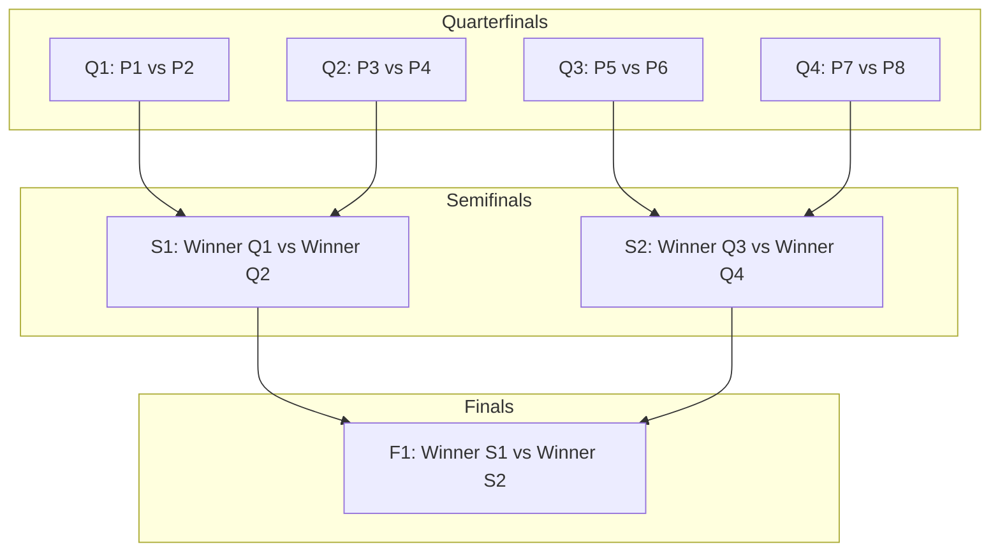

With competitive matchmaking running smoothly, we are scaling the tournament experience. This update details how Elo structures high-stakes, 8-player Blitz Tournaments, manages dynamic friendly lobbies, and enables immersive live spectating with interactive emoji reactions.

---

## 1. 8-Player Single-Elimination Tournament Brackets

At the core of the tournament experience is a fully automated, real-time Blitz tournament matchmaking queue. Once 8 players of comparable Elo ratings join the queue, the server initiates a single-elimination tournament tree:



### Dynamic Tournament Synchronization

1. **Parallel Matches**: Each match is run in parallel and constrained by a strict 60-second game clock.
2. **Early Completion Lobby**: Players who solve their questions quickly and finish the round early do not sit in a frozen UI. They are transitioned back to the **Tournament Lobby View**, where they can monitor the progress bars of other parallel matches in real time.
3. **Synchronized Round Kick-off**: Once all nodes in a round conclude, the server allocates a new `RoomID` for the next bracket, sends a 5-second countdown package, and opens the WebSocket stream for the advancing candidates.

---

## 2. Matchmaking & Dynamic Lobbies

Elo balances match quality and search time using a tiered, range-expansion matchmaking algorithm:

* **ELO Tier Scan**: The server initiates the search within a tight range ($\pm 100$ ELO). If no match is found, the window grows incrementally every 2 seconds.
* **Bot Backfill Safeguard**: If search time exceeds **20 seconds**, the matchmaking queue instantiates an adaptive server-side Bot matched to the player's ELO level.
* **Rule Selection & Ruleset Synchronization**: Inside private friendly rooms, hosts can configure custom lobby parameters, enabling/disabling specific math operations (e.g. addition, subtraction, division) or modifying round duration bounds. This config is synchronized across all participants instantly using Protobuf configurations.

---

## 3. Live Spectating & Interactive Reactions

Eliminated players or other active users can open the tournament bracket and spectate active match nodes.

* **Dual-Stream Tracking**: Spectators receive a real-time side-by-side feed of both players' active math problems, current scores, and ghost typing inputs.
* **Floating Emoji Reaction Stream**: Spectators can tap reactions (🔥, 🤯, ⚡) to send coordinates to the match room's socket. The server broadcasts these coordinates to all spectator instances, animating floating emojis on top of the live game view.

---

## 4. Extended Tournament Data Schema

The tournament updates introduce custom Protobuf messages for bracket states and emoji coordinates:

```protobuf
syntax = "proto3";

package elo.v3;

message TournamentBracket {
  string tournament_id = 1;
  repeated MatchNode nodes = 2;
  
  message MatchNode {
    string node_id = 1; // Q1-Q4, S1-S2, F1
    string player_one_id = 2;
    string player_two_id = 3;
    string winner_id = 4;
    int32 player_one_score = 5;
    int32 player_two_score = 6;
    bool is_active = 7;
  }
}

message SpectatorReaction {
  string room_id = 1;
  string emoji_char = 2;
  float coordinate_x = 3;
  float coordinate_y = 4;
}
```

---

## 5. Performance Indicators

| Metric | Target Goal | Verification Method |
| --- | --- | --- |
| **Lobby Load Settle Time** | Under 10ms | Native instrumentation of routing layout transitions. |
| **Bracket State Synchronization** | `< 50ms` | Network logs tracking timestamps between node resolution and clients receiving updates. |
| **Spectator Latency Overhead** | Negligible | Ensuring the main game loop thread is completely isolated from the spectator broadcast socket list. |

With bracket orchestration complete, we are turning our focus to multi-region global distribution, sharding, and high availability failover. Stay tuned!
